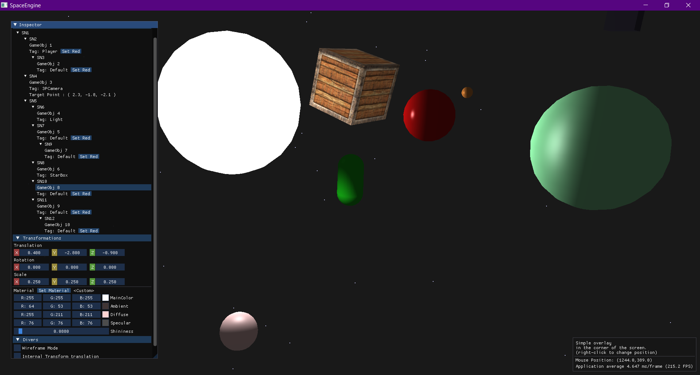

### Current State 

- Scene Graph
- Can use widgets (DragFloat) to act on gameobject (internal matrix transform)
- Adding UI for display internal matrix transform and global matrix transform in scene graph

